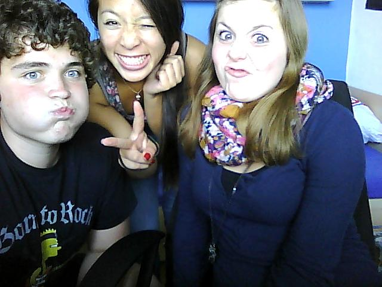

  <a href="#key-features">Key Features</a> •
  <a href="#how-to-use">How To Use</a> •
  <a href="#download">Download</a> •
  <a href="#credits">Credits</a> •
  <a href="#related">Related</a> •
  <a href="#license">License</a>

# Section 1
Column A    Column B    Column C
---------  ----------  ---------
Category 1    High        100.00
Category 2    High         80.50
---------  ----------  ---------

<!-- TABLE OF CONTENTS -->

  
Table of Contents

  <ol>
    <li>
      <a href="#about-the-project">About The Project</a>
      <ul>
        <li><a href="#built-with">Built With</a></li>
      </ul>
      <ul>
        <li><a href="#key-features">Key Features</a></li>
      </ul>
    </li>
    <li>
      <a href="#getting-started">Getting Started</a>
      <ul>
        <li><a href="#prerequisites">Prerequisites</a></li>
        <li><a href="#installation">Installation</a></li>
      </ul>
    </li>
    <li><a href="#shaders">Shaders</a></li>
    <li><a href="#tests">Tests</a></li>
    <li><a href="#roadmap">Roadmap</a></li>
    <li><a href="#contributing">Contributing</a></li>
    <li><a href="#license">License</a></li>
    <li><a href="#contact">Contact</a></li>
    <li><a href="#acknowledgements">Acknowledgements</a></li>
    <li><a href="#acknowledgements">Literature</a></li>
    <li><a href="#acknowledgements">Common issues</a></li>
  </ol>

<!-- ABOUT THE PROJECT -->
## About The Project

<h1 align="center">
   
  
  
  
</h1>

<!-- [![Kataglyphis Engine][product-screenshot1]](https://jotrockenmitlocken.de)
[![Kataglyphis Engine][product-screenshot2]](https://jotrockenmitlocken.de)
[![Kataglyphis Engine][product-screenshot3]](https://jotrockenmitlocken.de) -->

This project provides me a solid Vulkan renderer starting point
for implementing modern established rendering techniques and getting quickly
started in own research topics. 
Frequently tested under   
* [latest windows and ubuntu version]
* [GCC/CLANG/MSVC] 

### Key Features

<!--   -->
|          Feature                    |   Implement Status |
| ------------------------------------| :----------------: |
| Rasterizer                          |                  |
| Raytracing                          |                  |
| Path tracing                        |                  |
| PBR support (UE4,disney,... etc.)   |                  |
| .obj Model loading                  |                  |
| Mip Mapping                         |                  |
